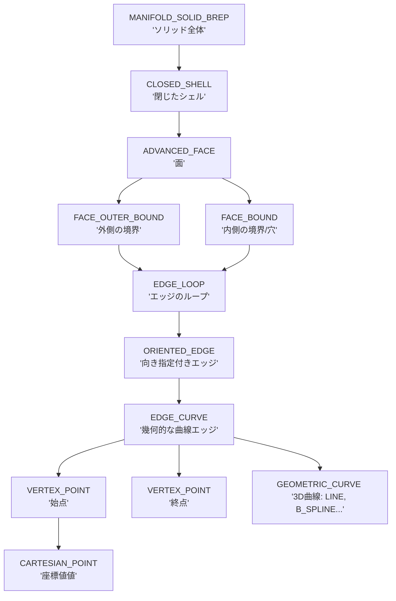

# STEPファイル（ISO 10303-21）のデータ構造解説

STEPファイル（特にAP203/214/242のB-Repデータ）におけるデータ構造、特に `SOLID`（`MANIFOLD_SOLID_BREP`）、`FACE`、`EDGE_LOOP` などの関係性について詳しく解説します。

## 1. 概要
STEPファイルは、3Dモデルの幾何形状（Geometry）と位相構造（Topology）を保持するための標準規格です。
B-Rep（Boundary Representation：境界表現）形式では、、「立体は面の集まりであり、面は線の集まりであり、線は点の集まりである」という階層構造でデータを管理します。

## 2. データ階層図（Topological Hierarchy）

STEPファイルにおけるデータの親子関係は以下のようになっています。



## 3. 主要なエンティティの種類と内容

### ① 位相要素（Topology）
物体の「接続関係」を定義する要素です。

| エンティティ名 | 説明 | 内容 |
| :--- | :--- | :--- |
| **MANIFOLD_SOLID_BREP** | ソリッド（固体） | 1つの塊としての3Dモデルを定義します。 |
| **CLOSED_SHELL** | シェル | 複数の面（Face）を繋ぎ合わせ、中身が詰まった空間を閉じ込める「抜けのない殻」です。 |
| **ADVANCED_FACE** | フェイス（面） | 1つの曲面パッチです。幾何形状（PLANE, CYLINDER等）と、境界（Loop）を持ちます。 |
| **FACE_OUTER_BOUND** | 外郭境界 | 面の最も外側の輪郭を定義するループへのリンクです。 |
| **FACE_BOUND** | 境界（穴） | 面の中にある「穴」の輪郭を定義します。 |
| **EDGE_LOOP** | エッジループ | 閉じた一本の線を構成する、連続したエッジのリストです。 |
| **ORIENTED_EDGE** | 向き付きエッジ | `EDGE_CURVE` を参照し、そのエッジを「順方向」に使うか「逆方向」に使うかを指定します。 |
| **EDGE_CURVE** | エッジ | 幾何的な曲線（Curve）と、その両端の頂点（Vertex）を結びつける要素です。 |
| **VERTEX_POINT** | 頂点 | 3D空間上の点（CARTESIAN_POINT）を、位相的な「端点」として定義します。 |

### ② 幾何要素（Geometry）
「形や位置」そのものを定義する要素です。

| エンティティ名 | 説明 |
| :--- | :--- |
| **CARTESIAN_POINT** | **デカルト座標点**。 `(X, Y, Z)` の数値を持ちます。 |
| **DIRECTION** | **方向ベクトル**。 `(I, J, K)` の正規化された方向を持ちます。 |
| **AXIS2_PLACEMENT_3D** | **座標系/配置**。原点、Z軸方向、X軸方向を定義し、面や立体の配置基準になります。 |
| **PLANE / CYLINDRICAL_SURFACE** | **平面 / 円筒面**。面自体の数学的な形状定義です。 |
| **LINE / CIRCLE / B_SPLINE_CURVE** | **線 / 円 / 自由曲線**。エッジの幾何学的な形状です。 |

## 4. データ構造の特徴：幾何と位相の分離

STEPファイルの面白い点は、**「どこにあるか（幾何）」と「どう繋がっているか（位相）」が明確に分かれている**ことです。

例えば、1本の立方体の辺（Edge）を考えるとき：
1. **幾何（Geometry）**: `#100 = LINE(...)` という無限に続く数式上の直線があります。
2. **位相（Topology）**: `#200 = EDGE_CURVE(頂点A, 頂点B, #100)` が、「直線#100のうち、頂点Aから頂点Bまでを辺として使う」と定義します。

これにより、同じ円筒面上に複数の面がある場合でも、基礎となる幾何データ（CYLINDRICAL_SURFACE）を複数の面（ADVANCED_FACE）から参照して共有することができます。

## 5. 具体的なデータの読み方（例）

以下は、1つの面（ADVANCED_FACE）を構成する典型的なデータの連鎖です。

```text
#200 = ADVANCED_FACE('', (#10), #50, .T.);       // 面（境界:#10, 幾何形状:#50）
#10  = FACE_OUTER_BOUND('', #5, .T.);            // 外側の境界（ループ:#5）
#5   = EDGE_LOOP('', (#1, #2, #3, #4));          // 4つのエッジを繋いだ輪郭
#1   = ORIENTED_EDGE('', *, *, #101, .T.);        // エッジ#101を順方向に利用
#101 = EDGE_CURVE('', #30, #31, #60, .T.);        // 頂点#30~#31を結ぶ曲線#60
#60  = LINE('', #70, #80);                        // 点#70を通り方向#80の直線
```

このように、一番下の「座標」や「数式」から、徐々に「点」→「線」→「面の輪郭」→「面」→「立体」へと組み上がっていく構造になっています。
